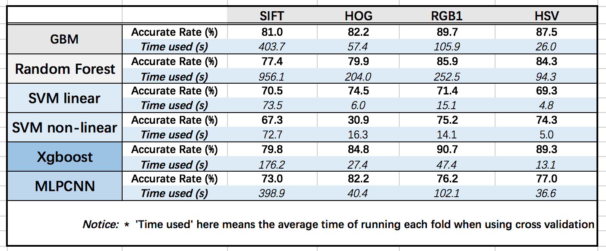

# Project: Dogs, Fried Chicken or Blueberry Muffins?


### [Full Project Description](doc/project3_desc.md)

Term: Fall 2017

+ Team 7
+ Team members
	+ 1 Carantino, Vassily
	+ 2 Gao, Xin 
	+ 3 Han, Lin
	+ 4 Li, Yijia
	+ 5 Shi, Qian

+ Project summary:    
  
In this project, we created a classification engine for images of Dogs, images of Fried Chicken and images of Blueberry Muffins. We set our baseline model using SIFT features and gradient boosting machine(GBM) classifier. Besides the SIFT features, we also used HOG, RGB and HSV to do feature selection. In terms of classifiers, we considered SVM(linear and non-linear), Random Forest, XGBoost and Neural Network. After model evaluation and comparison, the final advanced model we selected is using RGB feature and XGBoost classifier. We increased the accuracy by 12.0% and only took 11.7% of running time as in baseline model.

+ Outcome Analysis  
  


     
   
We can see that our baseline model is greater than random forest and SVM (linear and non-linear) under all feature selection methods. Only XGBoost gets higher accuracy than GBM based on HOG, RGB and HSV features.

  


     
  	
**Contribution statement**: ([default](doc/a_note_on_contributions.md)) All team members contributed equally in all stages of this project. All team members approve our work presented in this GitHub repository including this contributions statement. 

+ Carantino, Vassily
        
	+ Train and test SVM (linear and non-linear) model based on SIFT, HOG, RGB and HSV   
	(pick the best parameter of SVM model, test using cross validation) 
	+ Make the PPT and give the presentation
+ Gao, Xin          
                
	+ Train and test Random Forest model based on SIFT, HOG, RGB and HSV   
	(pick the best parameter of Random Forest model, test using cross validation) 
	+ Build the HOG function
	+ Generate README.Rmd and compare all the results
+ Han, Lin  
               
	+ Data processing, include data splitting and cleaning  
	+ Train and test MLPClassifier Neural Network model (using Python)based on SIFT, HOG, RGB and HSV  
	(pick the best parameter of Neural Network model, test using cross validation) 
	+ Build the HSV and RGB1 function and Extract HSV and RGB1 features
	+ Generate main.Rmd and feature.R
+ Li, Yijia  
        
	+ Train and test XGBoost model based on SIFT, HOG, RGB and HSV     
	(pick the best parameter of  XGBoost model, test using cross validation) 
	+ Extract HOG features (pick the best parameter of HOG)
	+ Generate main.Rmd, train.R, test.R, and cross_validation.R
+ Shi, Qian  
        
	+ Train and test gradient boosting machine model based on RGB, SIFT, HOG and HSV   
	(pick the best parameter of gradient boosting machine model, test using cross validation) 
	+ Build the HSV and RGB function and Extract HSV and RGB features
	+ Generate main.Rmd, train.R, test.R, and cross_validation.R


Following [suggestions](http://nicercode.github.io/blog/2013-04-05-projects/) by [RICH FITZJOHN](http://nicercode.github.io/about/#Team) (@richfitz). This folder is orgarnized as follows.

```
proj/
├── lib/
├── data/
├── doc/
├── figs/
└── output/
```

Please see each subfolder for a README file.
